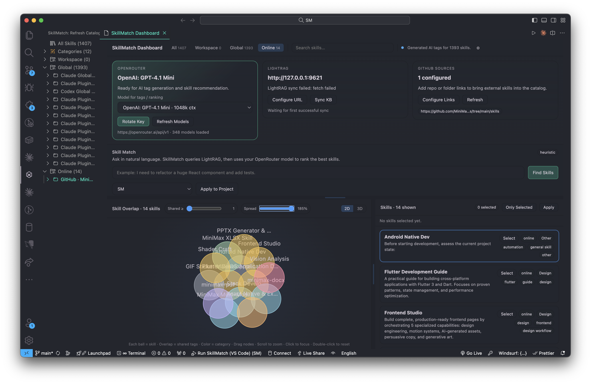
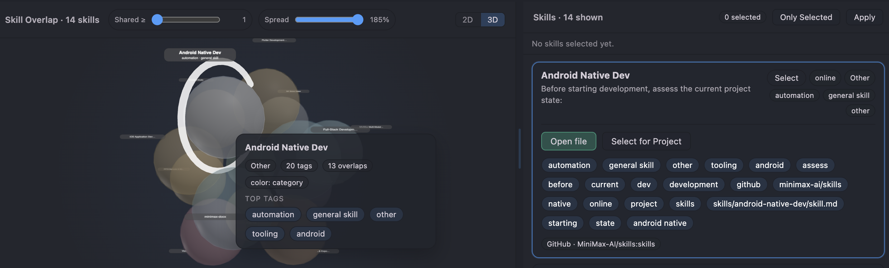
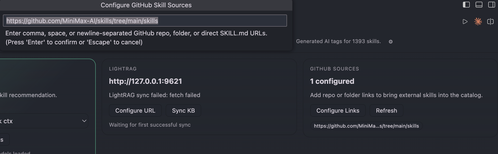

# SkillMatch

SkillMatch is a VS Code extension for discovering, classifying, visualizing, and applying AI agent skills from local folders, workspace folders, and online sources in one place.

## Why SkillMatch

- Discover skills from Claude, Codex, Copilot, Cursor, Gemini, OpenCode, and workspace-local skill folders.
- Pull in online skills from GitHub repositories, folders, or direct `SKILL.md` URLs.
- Enrich skills with OpenRouter-generated tags and categories.
- Sync the catalog into LightRAG for retrieval and ranking.
- Explore skill overlap in interactive 2D and 3D views.
- Apply selected skills into the current project with one workflow.

## Screenshots

Add your Marketplace screenshots in the sections below before publishing.

### Dashboard Overview



### 2D / 3D Skill Overlap



### OpenRouter + LightRAG Setup



## Key Features

### Unified Skill Catalog

SkillMatch scans local, workspace, and online sources, then groups everything into a single catalog that you can filter by scope, category, and search text.

### AI Tag Enrichment

With an OpenRouter API key configured, SkillMatch can generate tags for each skill and use the selected OpenRouter model to improve discovery and ranking.

### Skill Overlap Graph

The Overview panel includes an interactive overlap graph where each ball represents a skill, and overlap reflects shared tags. Both 2D and 3D views use the same skill graph data.

### Project Apply Flow

Recommended or manually selected skills can be copied into your current workspace under the configured project skill directory.

## Commands

- `SkillMatch: Refresh Catalog`
- `SkillMatch: Configure OpenRouter API Key`
- `SkillMatch: Open OpenRouter Settings`
- `SkillMatch: Clear OpenRouter API Key`
- `SkillMatch: Generate AI Tags`
- `SkillMatch: Configure LightRAG Base URL`
- `SkillMatch: Configure GitHub Skill Sources`
- `SkillMatch: Sync LightRAG Knowledge Base`
- `SkillMatch: Apply Recommended Skills To Project`
- `SkillMatch: Open Dashboard`

## Settings

- `skillMap.openRouter.baseUrl`
- `skillMap.openRouter.model`
- `skillMap.openRouter.autoGenerateTagsOnRefresh`
- `skillMap.openRouter.batchSize`
- `skillMap.lightRag.baseUrl`
- `skillMap.lightRag.autoSyncOnRefresh`
- `skillMap.lightRag.syncTimeoutMs`
- `skillMap.onlineSources.githubUrls`
- `skillMap.project.applyRelativePath`

## Data Storage

- OpenRouter API keys are stored in VS Code `SecretStorage`.
- AI-generated tags are cached in extension `context.globalState`.
- Recommended project skills are copied into the configured workspace-relative folder.

## Development

```bash
npm install
npm run compile
npm test
```

For interactive development:

```bash
npm run watch
```

Then launch `Run SkillMatch` from the VS Code debugger.

## Changelog

### 2026-06-07 — Harness/profile risk heatmap spec: tasks made actionable

The OpenSpec change for the upcoming harness/profile risk heatmap feature
(`2026-06-06-idea-skill-overlap-graph-harness-profile-risk-heatmap-with-allowe-vc0`)
had a placeholder `tasks.md` with entirely generic checklist items. A reviewer
noted this made the plan unactionable.

The tasks checklist was updated to reference the exact source locations that
will need to change when the feature is implemented:

- **`src/shared/types.ts`** — new `AgentProfileConfig`, `HarnessToolRisk`, and
  `SkillRiskScore` types, plus an optional `harnessProfile` field on `ViewState`.
- **`src/webview/main.ts:2203` (`graphNodeColor`)** — a new `'risk'` color mode
  that maps an aggregated risk score (Bash/Edit/Write presence × ECC-style
  review/confirm/block thresholds) to a cool→hot gradient.
- **`src/webview/main.ts:598` (`buildSkillOverlapGraph`)** — tool-surface edge
  weighting: shared allowed/disallowed tools between skill pairs blended into
  the D3 force link `weight` and the 3D layout attraction force.
- **`src/webview/main.ts:483`** — graph UI controls, adding `'risk'` to the
  `#graph-color-mode` select.
- Unit tests for the new risk-score and tool-surface overlap logic.

No source code was changed; only the planning document was made concrete so
that future implementation work can proceed without ambiguity.
